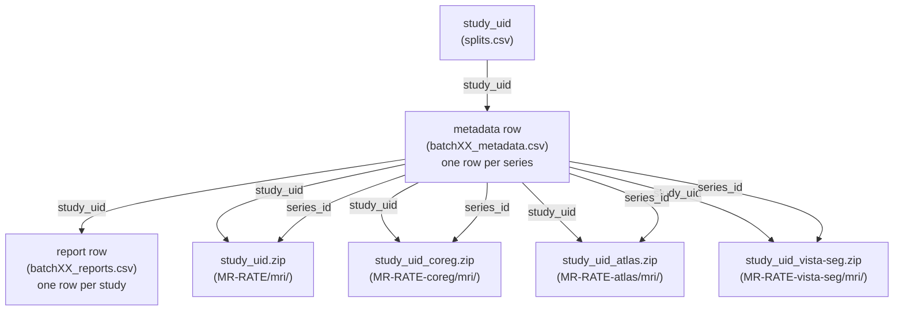

# MR-RATE Dataset Guide

A practical reference for understanding the structure and contents of the [MR-RATE dataset](https://huggingface.co/datasets/Forithmus/MR-RATE). For preprocessing implementation and details, see the [Data Preprocessing Submodule](../../data-preprocessing/). To explore the data interactively, visit the [Dataset Explorer](https://mrrate.forithmus.com/).

---

## Table of Contents

- [1. Key Concepts](#1-key-concepts)
  - [What is the MR-RATE dataset?](#what-is-the-mr-rate-dataset)
  - [Why is this specific MRI preprocessing?](#why-is-this-specific-mri-preprocessing)
  - [What is a patient, study, and series?](#what-is-a-patient-study-and-series)
  - [What is a series ID?](#what-is-a-series-id)
  - [What modalities and series are included?](#what-modalities-and-series-are-included)
  - [Can T1w series be contrast-enhanced?](#can-t1w-series-be-contrast-enhanced)
  - [Why are files zipped?](#why-are-files-zipped)
  - [Why are there four repositories?](#why-are-there-four-repositories)
  - [What are batches?](#what-are-batches)
  - [How does metadata connect everything?](#how-does-metadata-connect-everything)
  - [How are studies connected across repositories?](#how-are-studies-connected-across-repositories)
- [2. Repository Overview](#2-repository-overview)
- [3. Forithmus/MR-RATE — Native Space](#3-forithmusmr-rate--native-space)
- [4. Forithmus/MR-RATE-coreg — Co-registered Space](#4-forithmusmr-rate-coreg--co-registered-space)
- [5. Forithmus/MR-RATE-atlas — Atlas Space](#5-forithmusmr-rate-atlas--atlas-space)
- [6. Forithmus/MR-RATE-vista-seg — Segmentations](#6-forithmusmr-rate-vista-seg--segmentations)
- [7. Downloading Dataset](#7-downloading-dataset)
- [8. Connecting the Pieces](#8-connecting-the-pieces)

---

## 1. Key Concepts

### What is the MR-RATE dataset?

MR-RATE is a large-scale multimodal dataset comprising **705,254** non-contrast and contrast-enhanced brain and spine MRI volumes from **83,425** unique patients across **98,334** studies, spanning multiple sequence types (T1, T2, FLAIR, SWI, MRA) and paired with radiology reports and metadata — together constituting a unified resource for multimodal brain and spine MRI research. 

Raw DICOM files are converted to anonymized, defaced NIfTI volumes, spatially standardized via co-registration and atlas normalization, and enriched with multi-label brain segmentations, while reports and metadata are anonymized, translated, and restructured — all through open-source workflows, with the overarching goal of transforming raw, heterogeneous clinical data into a clean, anonymized, and spatially standardized collection ready for downstream machine learning and neuroscientific research.

---

### Why is this specific MRI preprocessing?

The reference for our preprocessing pipeline is the [BrainLesion Suite Preprocessing Module (BrainLes-Preprocessing Toolkit)](https://github.com/BrainLesion/preprocessing) which, among many other options, provide [ANTs](https://github.com/antsx/ants) for registration, [HD-BET](https://github.com/MIC-DKFZ/HD-BET) for binary brain mask segmentation and [Quickshear](https://github.com/nipy/quickshear) for defacing. We adapted `BrainLes-Preprocessing` substantially for our large-scale data preprocessing:

- **Improved CPU & GPU Utilization** — `BrainLes-Preprocessing` is designed to run all preprocessing steps (registration, brain segmentation, and defacing) for a given study sequentially in one pass. In this pipeline, GPU-based steps (`HD-BET` brain segmentation) and CPU-based steps (`ANTs` registration) alternate, leaving one resource idle while the other runs. Given the GPU-hours required for our dataset, we split the pipeline into two independent blocks — 1)registration and 2)brain segmentation & defacing  — so that each block can be optimized and scaled separately.

- **Parallelism & Inference Optimization** — Within each block, we parallelized study processing to utilize all available CPU cores and GPUs respectively. Furthermore, we optimized `HD-BET` inference for mixed-precision and batch inference to leverage modern GPU resources.

- **Block Re-rdering** — In a typical setup as in `BrainLes-Preprocessing`, registration comes first. Then other steps are applied to the center modality, and produced brain and defacing masks are mapped back to the moving modalities. We inverted this order for a practical reason: at the time of the project, our data storage cluster had high GPU availability but relatively low CPU availability. Running brain segmentation and defacing on all series indepently allowed us to complete the anonymization step quickly, after which the defaced data was transferred to a separate compute cluster where the registration block was run. As a byproduct of this re-ordering, brain masks are not bounded by the registration performance and are of comprable or higher quality.

---

### What is a patient, study, and series?

MR-RATE is organized around the three-level clinical hierarchy that mirrors how MRI data is structured in a hospital.

**Patient** — a unique individual, identified by a de-identified `patient_uid`. A patient may have undergone multiple MRI exams over time.

**Study** — a single imaging appointment (also called an examination). During a study, the patient is scanned with multiple pulse sequences, each producing a separate volume. A study is identified by a de-identified `study_uid` and is accompanied by a radiology report.

**Series** — a single MRI acquisition within a study (e.g., an axial T1-weighted scan). Each series produces one NIfTI volume and is identified by a `series_id`.

---

### What is a series ID?

Each series is assigned a `series_id` following this pattern:

```
{modality}-{role}-{plane}
```

For example: `t1w-raw-axi`, `flair-raw-sag`, `swi-raw-axi`.


| Component  | Values                              | Meaning                                                                            |
| ---------- | ----------------------------------- | ---------------------------------------------------------------------------------- |
| `modality` | `t1w`, `t2w`, `flair`, `swi`, `mra` | MRI sequence type                                                                  |
| `role`     | `raw`,                              | Raw (original) acquisition vs derived. MR-RATE currently includes raw series only. |
| `plane`    | `axi`, `sag`, `cor`, `obl`          | Axial, sagittal, coronal, or oblique acquisition plane                             |


When a study contains more than one acquisition with the same modality, role, and plane, a numeric suffix is appended to distinguish them: `t1w-raw-axi`, `t1w-raw-axi-2`, `t1w-raw-axi-3`, and so on. These are distinct acquisitions and may differ in scanning parameters (e.g., different echo times, slice thickness, or contrast timing).

---

### What modalities and series are included?

MR-RATE includes five MRI sequence types: **T1-weighted (T1w)**, **T2-weighted (T2w)**, **FLAIR**, **Susceptibility-Weighted Imaging (SWI)**, and **MR Angiography (MRA)**, with MRA being present in smaller quantities. Accepted acquisition planes are axial, sagittal, coronal, and oblique.

Series are accepted only when they meet all of the following criteria:


| Criterion         | Value                                |
| ----------------- | ------------------------------------ |
| Patient age       | ≥ 13 years                           |
| Volume shape      | ≥ 16 voxels in every axis            |
| Field of view     | 140–350 mm in every axis             |
| Acquisition plane | AXIAL, SAGITTAL, CORONAL, or OBLIQUE |
| Series type       | Non-derived (raw acquisitions only)  |


> **Body part labels coming soon**: MR-RATE contains both brain and spine MRI volumes. Series-level labels distinguishing brain from spine are currently being prepared and will be added to the metadata in a future update.

---

### Which series are contrast-enhanced?

**T1-weighted** acquisitions in MR-RATE can be either non-contrast or contrast-enhanced (gadolinium-based). The metadata does not currently include a contrast-enhancement label. As a practical heuristic, series with a lower `SeriesNumber` within a study were acquired earlier and are more likely to be non-contrast, since the contrast agent is typically injected partway through the exam.

---

### Why are there registration and segmentation derivatives along with native-space data?

While we currently only use native-space data for our model training, to support the broader research community, we additionally provide co-registered and atlas-registered volumes alongside multi-label brain segmentations. These derivatives allow researchers to bypass costly preprocessing steps and accelerate their own research workflows.

---

### Why are files zipped?

Hugging Face enforces a maximum number of files (~100,000) per dataset repository. Since each unzipped study contains multiple NIfTI volumes, uploading individual files would quickly exceed this limit. To stay within it, all imaging files for a study are compressed into a single `.zip` file before upload. This means a study's imaging data is always downloaded as a unit — individual files inside a zip cannot be selectively fetched. Since reports and metadata are stored as CSV files, they are not affected by the zipping.

Hugging Face offers alternative approaches to tackle file limits, such as 'Nifti feature in Datasets library' or 'WebDataset'. However, due to various reasons we have preferred zip archives for the current version.

---

### Why are there four repositories?

Different parts of the dataset serve different use cases and have very different storage requirements. Since zipping disables include/exclude pattern filtering for downloads, study folders for each part are zipped independently — allowing users to download only what their workflow needs. As the total number of zip files still exceeds Hugging Face's per-repository file limit, they are distributed across four repositories.

---

### How are studies connected across repositories?

Each zip file is named after its study: `<study_uid>.zip`, `<study_uid>_coreg.zip`, `<study_uid>_atlas.zip`, `<study_uid>_vista-seg.zip`. The `study_uid` is the stable key that ties together a study's data across all four repositories, both on Hugging Face and on local disk after downloading.

---

### What are batches?

The dataset was processed and uploaded in 28 batches named `batch00` through `batch27`. Batches serve two purposes: they are the unit of processing in the pipeline, and each batch maps ~~3500 studies to one folder (`mri/batchXX/`) to comply with Hugging Face's maximum number of files (~~10,000) per folder limit. All repositories share the same batch structure, so `batch05` in `MR-RATE-coreg` contains exactly the same studies as `batch05` in `MR-RATE`.

---

### How does metadata connect everything?

Three identifiers tie together all the files in the dataset:

```
patient_uid  →  groups all studies for one patient; joins to splits.csv
study_uid    →  links all series in a study, the radiology report, and the zip files
               across all four repos (MR-RATE, MR-RATE-coreg, MR-RATE-atlas, MR-RATE-vista-seg)
series_id    →  maps a metadata row to its NIfTI filename
```

**Metadata** (`batchXX_metadata.csv`) is series-level: one row per series, with `patient_uid`, `study_uid`, `series_id` columns.  
**Reports** (`batchXX_reports.csv`) are study-level: one row per study, joined to metadata via `study_uid`.  
**Splits** (`splits.csv`) are created on patient-level but are also on study-level as they are both UID: one row per study since a patient can have multiple studies, with `batch_id`, `patient_uid`, `study_uid`, `split` columns (`batch_id` is for the first appearance of a patient), joined to metadata via `study_uid`.

---

## 2. Repository Overview


| Repository                                                                                     | Size    | Contents                                                                                                                        |
| ---------------------------------------------------------------------------------------------- | ------- | ------------------------------------------------------------------------------------------------------------------------------- |
| **[Forithmus/MR-RATE](https://huggingface.co/datasets/Forithmus/MR-RATE)**                     | 8.2 TB  | Native-space defaced MRI volumes, brain masks, defacing masks, metadata CSVs, radiology report CSVs, data splits                |
| **[Forithmus/MR-RATE-coreg](https://huggingface.co/datasets/Forithmus/MR-RATE-coreg)**         | 17.6 TB | MRI volumes co-registered to the study's T1w center modality, registration transforms, center modality brain and defacing masks |
| **[Forithmus/MR-RATE-atlas](https://huggingface.co/datasets/Forithmus/MR-RATE-atlas)**         | 12.3 TB | MRI volumes in MNI152 atlas space, atlas registration transforms, center modality brain and defacing masks in atlas space       |
| **[Forithmus/MR-RATE-vista-seg](https://huggingface.co/datasets/Forithmus/MR-RATE-vista-seg)** | 52 GB   | Multi-label brain segmentation maps for selected center modality volumes in native space                                        |


---

## 3. Forithmus/MR-RATE — Native Space

This is the primary repository. It contains the native-space MRI volumes, the full metadata tables, radiology reports, and data splits. All other repositories are derivatives keyed on the same `study_uid`.

### Repository layout on Hugging Face

```plaintext
Forithmus/MR-RATE
├── mri/
│   ├── batch00/
│   │   ├── <study_uid>.zip
│   │   └── ...
│   ├── batch01/
│   └── ...                   (batch00–batch27)
├── metadata/
│   ├── batch00_metadata.csv
│   └── ...
├── reports/
│   ├── batch00_reports.csv
│   └── ...
└── splits.csv
```

### MRI Volumes

Each zip contains one study folder:

```plaintext
<study_uid>/
├── img/
│   └── <study_uid>_<series_id>.nii.gz         # Defaced native-space image (uint16 or float32)
└── seg/
    ├── <study_uid>_<series_id>_brain-mask.nii.gz    # Brain mask (uint8)
    └── <study_uid>_<series_id>_defacing-mask.nii.gz # Defacing mask (uint8)
```

Every series has three files — image, brain mask, and defacing mask — all in the same voxel space. Brain masks are predicted with [HD-BET](https://github.com/MIC-DKFZ/HD-BET) and defacing is applied with [Quickshear](https://github.com/nipy/quickshear). Both masks are released alongside the defaced volumes so they can be reused directly in downstream processing without rerunning inference.

See [MRI & Metadata Preprocessing](../README.md#mri--metadata-preprocessing) for the full implementation details.

### Metadata

**File:** `metadata/batchXX_metadata.csv`
**Granularity:** One row per series
**Join columns:** `patient_uid`, `study_uid`, `series_id`

The metadata CSV contains curated DICOM fields for each accepted series. Key columns, in their output order:


| Column                    | Description                                                                                                                                                                                                                      |
| ------------------------- | -------------------------------------------------------------------------------------------------------------------------------------------------------------------------------------------------------------------------------- |
| `patient_uid`             | De-identified patient identifier. Consistent across all studies for the same patient.                                                                                                                                            |
| `study_uid`               | De-identified study identifier. Links all series in a study, the radiology report, and derivative repo zips.                                                                                                                     |
| `series_id`               | Series identifier in `{modality}-{role}-{plane}[-N]` format. Directly maps to the NIfTI filename.                                                                                                                                |
| `classified_modality`     | Sequence type: `T1w`, `T2w`, `FLAIR`, `SWI`, or `MRA`.                                                                                                                                                                           |
| `is_derived`              | Whether the series is a derived image (e.g., a computed map). Currently always `False` in MR-RATE.                                                                                                                               |
| `acquisition_plane`       | Acquisition plane: `AXIAL`, `CORONAL`, `SAGITTAL`, or `OBLIQUE`.                                                                                                                                                                 |
| `SeriesNumber`            | Original DICOM series number. Useful as a proxy for acquisition order within the study.                                                                                                                                          |
| `is_localizer`            | Whether the series was classified as a localizer scan. Currently always `False` in MR-RATE.                                                                                                                                      |
| `is_subtraction`          | Whether the series was classified as a subtraction image. Currently always `False` in MR-RATE.                                                                                                                                   |
| `is_center_modality`      | Whether this series was selected as the T1w center modality for registration. Exactly one `True` per study.                                                                                                                      |
| `anon_study_date`         | Anonymized study date. A patient-specific random day offset is applied consistently across all studies for the same patient, preserving relative temporal ordering between a patient's studies while anontmizing absolute dates. |
| `classification_rule`     | Which rule tier assigned the modality label (e.g., diffusion tags, vendor sequence name, keyword match).                                                                                                                         |
| `sequence_family`         | Broad sequence family assigned during classification.                                                                                                                                                                            |
| `array_shape`             | Voxel dimensions of the NIfTI volume (e.g., `[256, 256, 192]`). Orientation might differ across series.                                                                                                                          |
| `array_spacing_mm`        | Voxel spacing in mm (e.g., `[1.0, 1.0, 1.0]`). Orientation might differ across series.                                                                                                                                           |
| `array_fov_mm`            | Field of view in mm per axis. Calculated by `shape * spacing`. Orientation might differ across series.                                                                                                                             |
| `Patient'sAge`            | Patient age in years at the time of the study.                                                                                                                                                                                   |
| `Patient'sSex`            | Patient sex.                                                                                                                                                                                                                     |
| `FlipAngle`               | RF flip angle in degrees.                                                                                                                                                                                                        |
| `TI_ms`                   | Inversion time in ms.                                                                                                                                                                                                            |
| `TE_ms`                   | Echo time in ms.                                                                                                                                                                                                                 |
| `TR_ms`                   | Repetition time in ms.                                                                                                                                                                                                           |
| `FieldStrength_T`         | MRI field strength in Tesla.                                                                                                                                                                                                     |
| `Manufacturer`            | Scanner manufacturer (e.g., Siemens, Philips, GE).                                                                                                                                                                               |
| `Manufacturer'sModelName` | Scanner model name.                                                                                                                                                                                                              |


Additional optional DICOM columns may be present depending on availability in the original PACS export. See [`config_metadata_columns.json`](../src/mr_rate_preprocessing/configs/config_metadata_columns.json) for the full list of possible columns.

> **Body part label**: A column distinguishing brain from spine series is currently being prepared and will be added in a future metadata update.

> **Contrast enhancement**: T1w series can be non-contrast or contrast-enhanced, but this is not currently labeled. Within a study, lower `SeriesNumber` values are more likely pre-contrast acquisitions.

See [MRI & Metadata Preprocessing](../README.md#mri--metadata-preprocessing) for the full implementation details.

### Radiology Reports

**File:** `reports/batchXX_reports.csv`  
**Granularity:** One row per study  
**Join column:** `study_uid`

Each radiology report was originally written in Turkish by a radiologist. It was anonymized to remove protected health information, translated to English, and restructured into standardized sections through an LLM-based pipeline using [Qwen3.5-35B-A3B-FP8](https://huggingface.co/Qwen/Qwen3.5-35B-A3B-FP8) via [vLLM](https://github.com/vllm-project/vllm).


| Column                 | Description                                                                                  |
| ---------------------- | -------------------------------------------------------------------------------------------- |
| `study_uid`            | De-identified study identifier. Join to metadata on this column.                             |
| `report`               | Full translated English report.                                                              |
| `clinical_information` | Clinical indication or patient history section. Empty if not present in the original report. |
| `technique`            | Imaging technique and sequences used.                                                        |
| `findings`             | All observations, written as flowing paragraph sentences.                                    |
| `impression`           | Radiologist's conclusions, formatted as em-dash (—) bullet points.                           |


Anonymization tokens — `[patient_1]`, `[date_1]`, `[radiologist_1]`, `[hospital_1]`, etc. — are present in the text wherever PHI was replaced during anonymization.

See [Radiology Report Preprocessing](../README.md#radiology-report-preprocessing) for the full implementation details.

### Data Splits

**File:** `splits.csv`  
**Granularity:** One row per patient  
**Join column:** `patient_uid`

Patient-level splits for reproducible benchmarking. All studies and series of a given patient fall in the same split.


| Split      | # Patients   | # Studies    | # Series      |
| ---------- | ---------- | ---------- | ----------- |
| Train      | 75,000     | 88,985     | 638,345     |
| Validation | 3,425      | 3,781      | 27,003      |
| Test       | 5,000      | 5,568      | 39,906      |
| **Total**  | **83,425** | **98,334** | **705,254** |


---

## 4. Forithmus/MR-RATE-coreg — Co-registered Space

Within each study, all brain MRI volumes are spatially aligned to a shared reference frame. A single T1w raw series is designated the **center modality** (marked `is_center_modality=True` in the metadata). All other series in the study — the **moving modalities** — are registered to the center using [ANTs](https://github.com/antsx/ants), bringing every brain MRI sequence of a study into a common anatomical space for within-study cross-modal analysis. For registration, the following parameters are used: `Rigid` transform, `linear` interpolation and `Mattes` (Mattes mutual information) metric are used.

### Repository layout on Hugging Face

```plaintext
Forithmus/MR-RATE-coreg
└── mri/
    ├── batch00/
    │   ├── <study_uid>_coreg.zip
    │   └── ...
    └── ...                   (batch00–batch27)
```

### Unzipped study folder

```plaintext
<study_uid>/
├── coreg_img/
│   ├── <study_uid>_<center_series_id>.nii.gz         # Center modality (unchanged copy from native) (uint16 or float32)
│   └── <study_uid>_coreg_<moving_series_id>.nii.gz   # Moving modalities warped to center space (float32)
├── coreg_seg/
│   ├── <study_uid>_<center_series_id>_brain-mask.nii.gz    # Center modality brain mask (unchanged copy from native) (uint8)
│   └── <study_uid>_<center_series_id>_defacing-mask.nii.gz # Center modality defacing mask (unchanged copy from native) (uint8)
└── transform/
    └── M_coreg_<moving_series_id>.mat                 # Moving→center ANTs transform (one per moving modality)
```

The center modality appears in `coreg_img/` as an unchanged copy of its native-space image from `MR-RATE`. Brain and defacing masks in `coreg_seg/` are the center modality's masks from native-space — since all volumes are now in the center's space, these masks apply uniformly to every series in the study. One `.mat` registration transform file is produced per moving modality.

See [Registration](../README.md#registration) for the full implementation details.

---

## 5. Forithmus/MR-RATE-atlas — Atlas Space

The center modality from each study is registered to the [MNI152 ICBM 2009c Nonlinear Symmetric](https://nist.mni.mcgill.ca/icbm-152-nonlinear-atlases-2009/) atlas using [ANTs](https://github.com/antsx/ants). All co-registered moving modalities are then propagated to atlas space using the composed transform, putting every volume in the study into a standardized coordinate system for group-level analyses and cross-patient comparisons. For registration, the following parameters are used: `Rigid` transform, `linear` interpolation and `Mattes` (Mattes mutual information) metric are used.

### Repository layout on Hugging Face

```plaintext
Forithmus/MR-RATE-atlas
└── mri/
    ├── batch00/
    │   ├── <study_uid>_atlas.zip
    │   └── ...
    └── ...                   (batch00–batch27)
```

### Unzipped study folder

```plaintext
<study_uid>/
├── atlas_img/
│   ├── <study_uid>_atlas_<center_series_id>.nii.gz         # Center modality in atlas space (float32)
│   └── <study_uid>_atlas_<moving_series_id>.nii.gz         # Moving modalities in atlas space (float32)
├── atlas_seg/
│   ├── <study_uid>_atlas_<center_series_id>_brain-mask.nii.gz    # Brain mask in atlas space (uint8)
│   └── <study_uid>_atlas_<center_series_id>_defacing-mask.nii.gz # Defacing mask in atlas space (uint8)
└── transform/
    └── M_atlas_<center_series_id>.mat                 # Center→atlas ANTs transform
```

The `transform/` folder here contains the center-to-atlas warp. When `MR-RATE-coreg` and `MR-RATE-atlas` are both downloaded and merged into `MR-RATE/`, the `transform/` subdirectory for each study will contain both the moving→center transforms (from coreg) and the center→atlas transform (from atlas) with no filename collisions.

See [Registration](../README.md#registration) for the full implementation details.

---

## 6. Forithmus/MR-RATE-vista-seg — Segmentations

Voxel-wise multi-label brain segmentations are predicted for the center modality of each study in native space using [NV-Segment-CTMR](https://github.com/NVIDIA-Medtech/NV-Segment-CTMR) based on [VISTA3D](https://github.com/Project-MONAI/VISTA/tree/main/vista3d). Segmentations support region-of-interest analysis and other downstream tasks requiring anatomical parcellations.

> **Coverage note**: Not all studies have a segmentation. Segmentation is only run for center modality volumes that pass additional shape and spacing quality thresholds for optimal NV-Segment-CTMR performance. Check whether a `<study_uid>_vista-seg.zip` exists in the batch folder before assuming coverage for a given study.

### Repository layout on Hugging Face

```plaintext
Forithmus/MR-RATE-vista-seg
└── mri/
    ├── batch00/
    │   ├── <study_uid>_vista-seg.zip
    │   └── ...
    └── ...                   (batch00–batch27)
```

### Unzipped study folder

```plaintext
<study_uid>/
└── seg/
    └── <study_uid>_<center_series_id>_vista-seg.nii.gz   # Multi-label segmentation map
```

The segmentation map is in the same native space and voxel grid as the center modality image in `MR-RATE/mri/batchXX/<study_uid>/img/`. Segmentation labels follow the NV-Segment-CTMR label map.

See [Multi-label Brain Segmentation](../README.md#multi-label-brain-segmentation) for the full implementation details.

---

## 7. Downloading Dataset

Please see the [Downloading Dataset](../README.md#downloading-dataset). To ensure convenient and reliable maintenance, the dataset download instructions are published from a single source.

---

## 8. Connecting the Pieces

The diagram below shows how identifiers and files relate across all dataset components:

